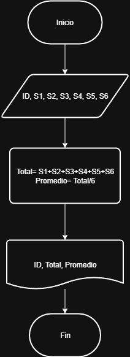
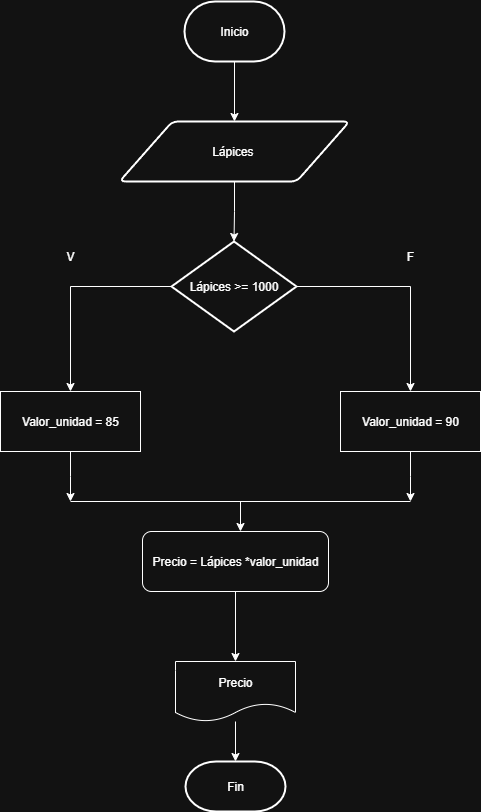
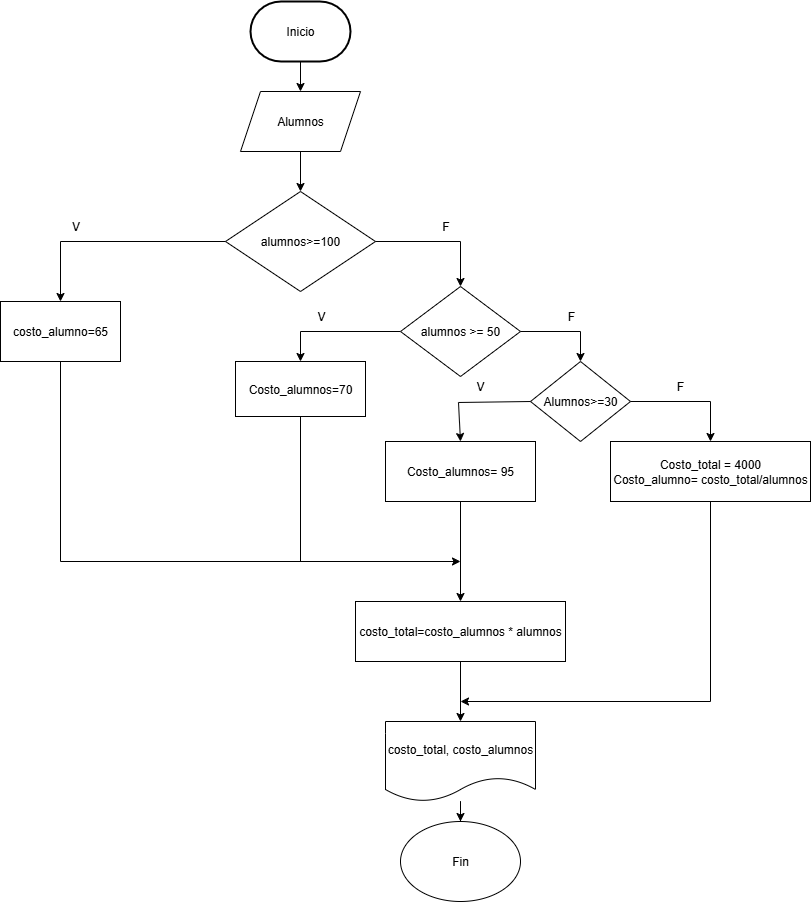

# ACTIVIDAD 2
## EJERCICIO 1
¿Cuáles son los símbolos que se utilizan para representar cada operación de un algorimo con un diagrama de flujo?


## EJERCICIO 2
## Solución


## Pseudocódigo
```
Inicio
Leer Id, S1, S2, S3, S4, S5, S6
Total= S1 + S2 +S3 + S4 + S5 + S6
Promedio= Total / 6
Escribir ID, Total, Promedio
Fin 
```
## Diagrama de flujo




## EJERCICIO 3 
Realice un algoritmo para determinar cuánto se debe pagar por equis cantidad de lápices considerando que si son 1000 o más el costo es de $85 cada uno; de lo contrario, el precio es de $90. Represéntelo con el pseudocódigo y el diagrama de flujo.

|Variables|Tipo|Comentario|
|---------|----|----------|
|Lápices | Entrada| Cantidad de lápices |
|Precio | Salida| Precio total de los lápices|
|Valor_unidad| Intermedia | Valor unitario de cada lapiz|
|85, 90| Constantes| No cambian|

### Pseudocódigo

```
Inicio
Leer Lápices 
Si lápices >= 1000
    valor_unidad = 85
Si no
    valor_unidad = 90
Fin Si
Precio = Lápices *valor_unidad
Escribir "El valor total es:", Precio
Fin
```

### Diagrama de flujo




## Ejercicio 4 
Un almacén de ropa tiene una promoción: por compras superiores a $250 000 se les aplicará un descuento de 15%, de caso contrario, sólo se aplicará un 8% de descuento. Realice un algoritmo para determinar el precio final que debe pagar una persona por comprar en dicho almacén y de cuánto es el descuento que obtendrá. Represéntelo mediante el pseudocódigo y el diagrama de flujo.

### Análisis

|Variables|Tipo| Comentario|
|---------|----|-----------|
| Total_compra | Entrada | Valor de la compra|
| Descuento | Salida | Descuento según el valor de la compra |
| Precio_final | Salida | Valor a pagar |
|15%, 8%, $250000 | Constantes | Descuentos y valor límite |

### Pseudocódigo
```
Inicio
Leer total_compra
Si total_compra > 250000
    descuento = total_compra * 0.15
Si no
    descuento = total_compra * 0.08
Fin si
precio_final = total_compra - descuento
Escribir "Valor a pagar:", precio_final
Fin
```

### Diagrama de flujo


## Ejercicio 5
El director de una escuela está organizando un viaje de estudios, y requiere determinar cuánto debe cobrar a cada alumno y cuánto debe pagar a la compañía de viajes por el servicio. La forma de cobrar es la siguiente: si son 100 alumnos o más, el costo por cada alumno es de $65.00; de 50 a 99 alumnos, el costo es de $70.00, de 30 a 49, de $95.00, y si son menos de 30, el costo de la renta del autobús es de $4000.00, sin importar el número de alumnos.

### Análisis

|Variables|Tipo| Comentario|
|---------|----|-----------|
|Alumnos | Entrada| Número de alumnos |
|Costo_alumno| Salida|  Valor a cobrar a los alumnos| 
|Costo_total| Salida | Valor a pagar al trabajador |
|alumnos>=100, 30<= alumnos >= 49, 50<= alumnos >= 99, alumnos<30 | Constante | Rangos cantidad de alumnos| 

### Pseudocódigo

```
Inicio
Leer Alumnos
Si alumnos > 100
    costo_alumno = 65
Si no 
    Si alumnos >=50
        costo_alumno = 70
    Si no
        Si alumnos >= 50
            costo_Alumno = 95
        Si no 
            costo_total = 4000
            costo_alumno = costo_total/alumno
        Fin si
    Fin si
Fin si
costo_total = costo_alumnos *alumnos
Escribir "costo_total, costo_alumno"
Fin
```
### Diagrama de flujo




