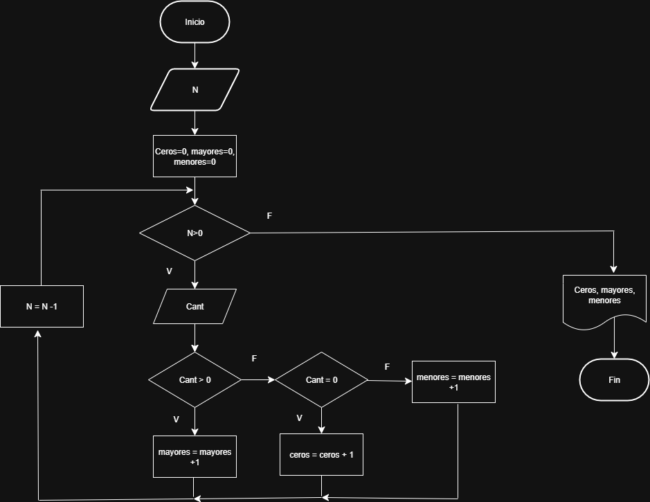

# EJERCICIOS Y EJEMPLOS BUCLES

## Ejercicio 2
Se requiere un algoritmo para determinar, N cantidades, cuántas son cero, cuántas son menores a cero y cuántas son mayores a cero.

|Variables|Tipo|
|---------|----|
|N| Entrada|
|Ceros, mayores, menores| Salida|
|N| Control|
|Cantidad| Entrada|

### Diagrama de flujo



### Pseudocódigo

```
Inicio
Leer N
Ceros=0, Mayores=0, Menores=0
Mientras N>0
    Leer Cant
    Si Cant>0
        Mayores=Mayores+1
    Si no
        Si cant=0
            Ceros=Ceros+1
        Si no
            Menores=Menores+1
        Fin si
    Fin si
    N=N-1
Fin mientras
Escribir Ceros, Mayores, Menores
Fin
```

## Ejercicio 3
Calcular el factorial de un número.

|Variables|Tipo|
|---------|----|
|N| Entrada|
|Factorial| Salida| 
|N| Control|

### Pseudocódigo

```
Inicio 
Leer N
Factorial = 1
Mientras N>0
    Si N>0
       Factorial = factorial * N
       N=N-1
     Fin mientras
    Si no
      Imprimir Factorial
Fin
```