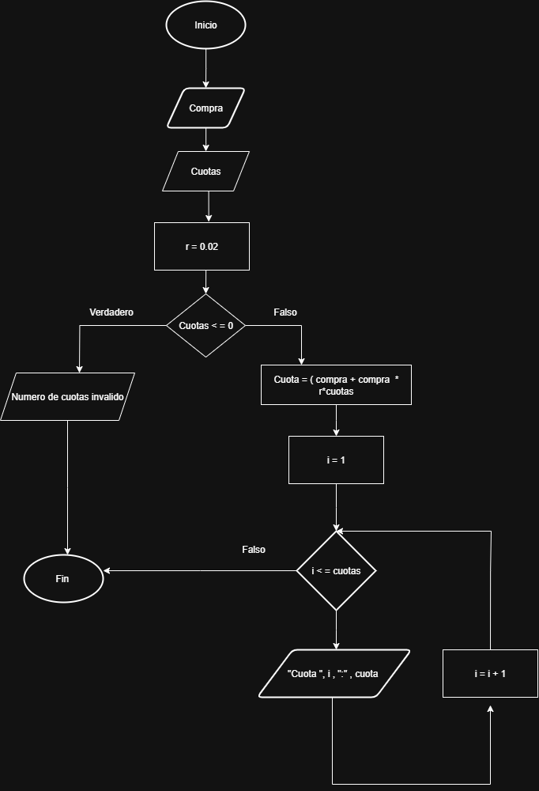

# TAREA 1
```
Inicio
    leer compra
    leer cuotas
    r = 0.02
    si cuotas <= 0 entonces
        escribir "numero de cuotas invalido"
    sino
        cuota = (compra + compra*r*cuotas) / cuotas
        i = 1
        mientras i <= cuotas hacer
            Escribir "cuota ", i, ": ", cuota
            i = i + 1
        fin mientras
    fin si
Fin
 ```


