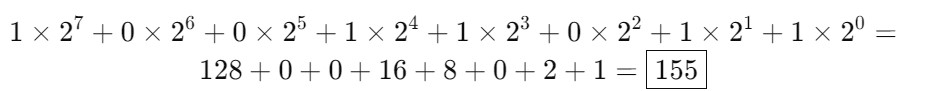

# TAREA 1 
- ¿Por qué las computadoras usan binario para representar los datos?
R/: Porque las computadoras funcionan con electricidad, y sus componentes solo entienden dos estados: encendido o apagado. Esos dos estados se representan con los números 1 y 0, que forman el sistema binario. Entonces, en vez de usar números normales, las computadoras usan combinaciones de unos y ceros para representar todo tipo de información: texto, imágenes, música, videos, instrucciones.
- Convierte el número binario 10011011 a decimal y hexadecimal
R/: 10011011 --> Decimal 

 10011011 --> hexadecimal 
 1001 = 9, 1011 = B
  = 9B
- ¿Cómo se guarda una imagen en formato PNG en el disco?
R/: Cuando guardas una imagen como PNG, el computador no guarda los dibujitos como tal, sino que convierte cada píxel en datos. Cada píxel tiene un color, y ese color se guarda como una combinación de números. Además, PNG comprime la imagen, o sea, la hace más liviana sin que pierda calidad. Es como cuando guardas ropa al vacío para que ocupe menos espacio. Todo eso se organiza en partes dentro del archivo: una parte dice el tamaño de la imagen, otra guarda los colores, otra dice cuándo termina el archivo, etc. Es como si la imagen estuviera hecha de cajitas con información.

- ¿Qué pasa si intento guardar un número más grande de lo que cabe en un byte (como 300)? ¿Y cómo lo maneja Python?
R/:Un byte puede guardar números entre 0 y 255. Si tú intentas meter algo más grande, como 300, simplemente no cabe. En otros lenguajes, como C, eso puede hacer que el número se "desborde" y salga algo raro. Pero Python es más inteligente: si ve que el número no cabe en un byte, lo guarda usando más espacio automáticamente.Por ejemplo, Python sí puede guardar el 300, pero usará 2 bytes en lugar de uno. Ahora, si tú le dices a la fuerza que lo meta en un solo byte, Python te va a decir que hay un error.
