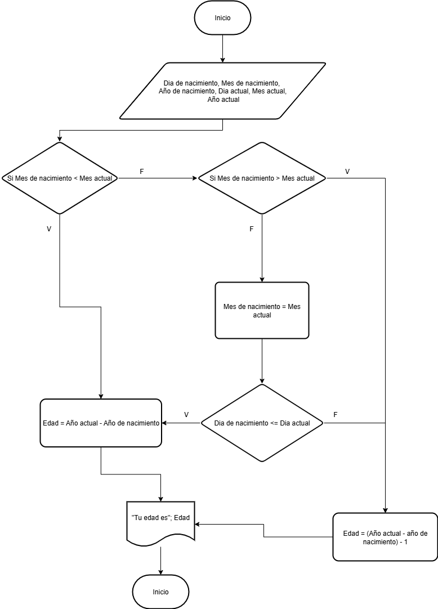

# TAREA 3

|Variables| Tipo| Comentario|
|---------|-----|-----------|
|Dia de nacimiento|Entrada|Dia en el que nacio|
|Mes de nacimiento|Entrada|# mes en que nacio|
|Año de nacimiento|Entrada|Año en que nacio|
|Dia actual|Entrada|Dia actual|
|Mes actual|Entrada|#Mes actual|
|Año actual|Entrada|Año actual|
|Edad|Salida|Edad que tiene|


## Pseudocódigo
```
Inicio
Leer Dia de nacimiento, Mes de nacimiento, Año de nacimiento, Dia actual, Mes actual, Año actual
Si Mes de nacimiento < Mes actual
    Fin si
    Edad = Año actual - Año de nacimiento
Si no 
    Si mes de nacimiento > mes actual
        Fin si
        Edad = (Año actual - año de nacimiento) - 1
    Si no
        mes de nacimiento = mes actual    
            Si Dia de nacimiento <= Dia actual 
                Fin si 
                Edad = Año actual - Año de nacimiento 
            Si no 
                Edad = (Año actual - año de nacimiento) - 1
        
Escribir "Tu edad es"; Edad
Fin
```
## Diagrama de flujo
